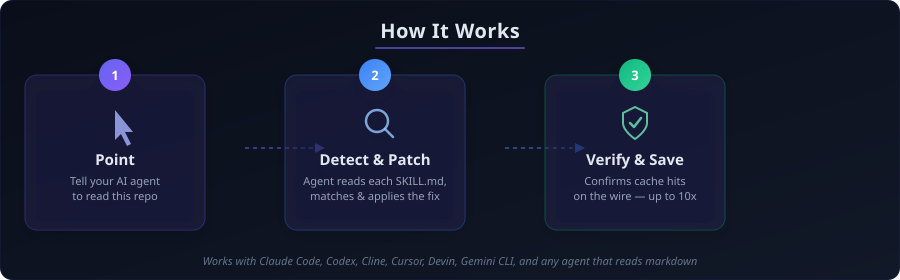
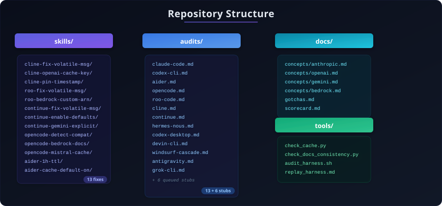
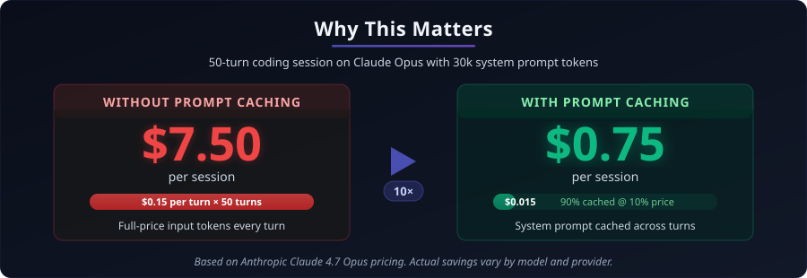
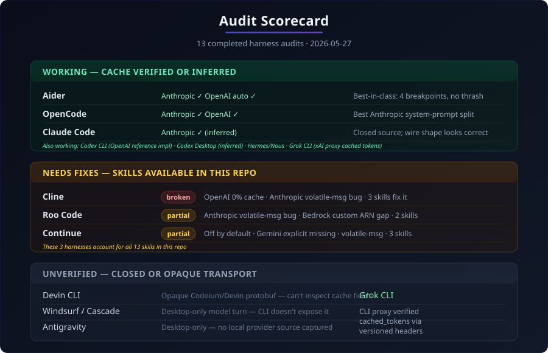
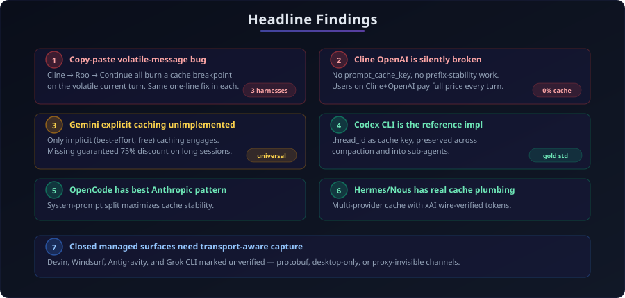

<p align="center">
  
</p>

<p align="center">
  <a href="#how-to-use-it"></a>
  <a href="skills/README.md"></a>
  <a href="docs/scorecard.md"></a>
  <a href="#why-this-exists"></a>
</p>

<p align="center">
  <a href="LICENSE"></a>
  <a href="CHANGELOG.md"></a>
  <a href="CONTRIBUTING.md"></a>
</p>

---

Most popular OSS agent harnesses (Cline, Roo Code, Continue, OpenCode,
Aider) leave **30-90% off your API bill** on the table because their
prompt-caching code is subtly wrong, off-by-default, or just missing
for some providers.

This repo is a set of **drop-in skills** that any AI coding agent
(Claude Code, Codex, Cline, Cursor, Devin, Gemini CLI, OpenCode…) can
read and apply on its own.

You don't read the diffs. You point your agent at this repo and say:

> *"Apply every skill in this repo that matches the harnesses I use."*

The agent reads each `SKILL.md`, checks if it applies to your setup,
lands the diff, and verifies the fix on the wire. You go from broken
or partial caching to **80-99% cache hit rates** without doing the
research yourself.

---

## What you actually save

One row per completed audit, so the coverage matches the scorecard:

| Harness | Finding | Cost impact today | Fix / status |
|---------|---------|-------------------|--------------|
| Claude Desktop Code | Default Desktop Code launches embedded Claude Code; clean Mac logs show non-zero cache read/create counters by default | Already gets Anthropic cache benefits; no prompt-caching fix needed | No skill; working baseline |
| Codex CLI | Correct OpenAI cache design: stable `thread_id` cache key | Already gets OpenAI cache benefits | No skill; reference implementation |
| Aider | `--cache-prompts` off by default; 5min TTL/keepalive overhead | Many users get 0% cache reads unless they opt in; shorter cache window | Skills: default-on caching + 1h TTL |
| OpenCode | Strong Anthropic path, but proxy/Bedrock edge cases exist | Some OpenAI-compatible→Anthropic/Bedrock routes miss cache | Skills: proxy detection + Bedrock doc-block fix |
| Roo Code | Anthropic volatile-message bug; Bedrock custom ARN gap | Wastes breakpoints; custom ARNs can drop to 0% cache reads | Skills: volatile-msg fix + Bedrock custom ARN fix |
| Cline | Anthropic volatile-message bug; OpenAI lacks `prompt_cache_key` | Wastes Anthropic breakpoint; OpenAI native can get 0% cache reads | Skills: volatile-msg fix + OpenAI cache key + timestamp pin |
| Continue | Cache opt-in default; Gemini explicit caching missing; volatile-message bug | Many users get 0% cache reads; Gemini relies on implicit luck | Skills: default-on + volatile-msg + Gemini explicit cache |
| Hermes / Nous | Multi-provider cache plumbing works; xAI wire showed cached tokens | No verified savings bug in this audit | No skill; working audit |
| Codex Desktop | ChatGPT Codex backend cache-scope headers observed/inferred | No verified savings bug in this audit | No skill; inferred working |
| Devin CLI | Raw CLI model path is opaque Codeium/Devin protobuf | Cache behavior not inspectable from public CLI capture | No skill; unverified managed backend |
| Windsurf / Cascade | Closed desktop; model turn not captured from CLI | Cache behavior unverified | No skill; needs desktop capture |
| Antigravity | Closed desktop; no model turn captured | Cache behavior unverified | No skill; needs desktop capture |
| Grok CLI | Documented CLI chat proxy returns non-zero `prompt_tokens_details.cached_tokens` with real CLI headers | Already gets xAI cache benefits through managed proxy | No skill; working managed proxy |

13 skills total cover the verified patchable OSS bugs. See
[`skills/README.md`](skills/README.md) for the full index.

---

## How to use it

<p align="center">
  
</p>

### Option A — point any AI coding agent at this repo

In your agent of choice (Claude Code, Codex, Cline, Cursor, Devin, etc.):

```
Read https://github.com/OnlyTerp/prompt-cache-skills

Apply every skill in skills/ that matches the harnesses I currently
use. For each one:
1. Confirm the target file exists in my project at the cited path.
2. Apply the diff.
3. Run the SKILL's Verify steps and confirm the assertion passes.
4. If verify fails, revert and tell me why.
```

That's it. The agent picks up the rest from each `SKILL.md`'s
machine-readable frontmatter and instructions.

### Option B — install as a skill bundle in Claude Code / Devin / etc.

If you use one of the agents that supports a skills directory:

```bash
# Claude Code
git clone https://github.com/OnlyTerp/prompt-cache-skills ~/.claude/skills/prompt-cache-skills

# Devin
git clone https://github.com/OnlyTerp/prompt-cache-skills ~/.config/devin/skills/prompt-cache-skills

# OpenCode
git clone https://github.com/OnlyTerp/prompt-cache-skills ~/.config/opencode/skills/prompt-cache-skills
```

Then ask your agent:

```
Run the prompt-cache-skills bundle on this codebase.
```

### Option C — read and apply by hand

Each [`skills/<name>/SKILL.md`](skills/) is a complete fix: target,
symptom, diff, verification. Apply the relevant ones manually if you
don't trust your agent to do it.

---

## What's in here

<p align="center">
  
</p>

```
prompt-cache-skills/
├── skills/                       ← the fixes (this is what your agent reads)
│   ├── cline-fix-volatile-msg/
│   ├── cline-openai-cache-key/
│   ├── cline-pin-timestamp/
│   ├── roo-fix-volatile-msg/
│   ├── roo-bedrock-custom-arn/
│   ├── continue-fix-volatile-msg/
│   ├── continue-enable-defaults/
│   ├── continue-gemini-explicit/
│   ├── opencode-detect-openai-compat/
│   ├── opencode-bedrock-doc-blocks/
│   ├── opencode-mistral-cache-key/
│   ├── aider-1h-ttl/
│   └── aider-cache-default-on/
├── audits/                       ← evidence: completed audits + queued stubs
│   ├── cline.md
│   ├── roo-code.md
│   ├── aider.md
│   ├── opencode.md
│   ├── continue.md
│   ├── codex-cli.md              ← (reference, already correct)
│   ├── claude-code.md
│   ├── hermes-nous.md
│   ├── codex-desktop.md
│   ├── devin-cli.md
│   ├── windsurf-cascade.md
│   ├── antigravity.md
│   ├── grok-cli.md
│   └── queued stubs: crush, goose, aichat, gptme, avante-nvim, kilo-code
├── docs/                         ← the underlying API mechanics
│   ├── concepts/                 ← per-provider caching reference
│   ├── gotchas.md                ← 16 numbered footguns
│   ├── verification.md           ← how to confirm caching on wire
│   └── scorecard.md              ← completed audits graded at a glance
├── tools/                        ← scripts to verify caching + doc consistency
│   ├── check_cache.py            ← fire request twice, dump cache_* fields
│   ├── check_docs_consistency.py ← assert counts/tables/links don't drift
│   ├── audit_harness.sh
│   └── replay_harness.md
└── AGENTS.md                     ← entry point for AI agents reading this repo
```

---

## Why this exists

<p align="center">
  
</p>

If your agent harness sends 30,000 tokens of system prompt + tools per
turn, on Claude 4.7 Opus that's $0.15 per turn uncached vs $0.015
cached — a 10x difference. A 50-turn coding session costs $7.50 vs
$0.75. **You're paying 10x what you should be** because the harness
you use either:

- doesn't set `cache_control` at all,
- sets it on volatile content that thrashes the cache,
- doesn't set `prompt_cache_key` for OpenAI,
- has caching gated behind a config flag you never set, or
- just doesn't implement it for one of your providers.

None of these are hard to fix. They're all 5-15 line diffs. The
hard part is knowing which one applies to your harness and getting it
right. This repo does that work for you.

---

## The grade card

<p align="center">
  
</p>

13 completed harness audits, dated 2026-05-27. The original 7 include the default Claude Desktop Code baseline, source-recon audits for Codex CLI, Aider, OpenCode, Roo Code, Cline, and Continue, plus extended source/wire/local-install audits for Hermes/Nous, Codex Desktop, Devin CLI, Windsurf/Cascade, Antigravity, and Grok CLI. Six more files in `audits/` are queued stubs, not completed audits.

| Harness | Anthropic | OpenAI | Bedrock | Gemini | Managed/other |
|---------|-----------|--------|---------|--------|---------------|
| Claude Desktop Code | **working (default Desktop Code verified)** | n/a | n/a | n/a | n/a |
| Codex CLI | n/a | **working** | n/a | n/a | n/a |
| Aider | working | automatic | n/a | n/a | n/a |
| OpenCode | working | working | partial | n/a | n/a |
| Roo Code | partial | working | partial | n/a | n/a |
| Cline | partial | **broken** | unverified | n/a | n/a |
| Continue | partial | partial | partial | broken | n/a |
| Hermes / Nous | **working** | working (Responses) | n/a | unverified | xAI working |
| Codex Desktop | n/a | working* | n/a | n/a | ChatGPT Codex backend inferred |
| Devin CLI | n/a | n/a | n/a | n/a | unverified (opaque protobuf) |
| Windsurf / Cascade | n/a | n/a | n/a | n/a | unverified (desktop not captured) |
| Antigravity | n/a | n/a | n/a | unverified | unverified (desktop not captured) |
| Grok CLI | n/a | n/a | n/a | n/a | **working (xAI CLI proxy cached tokens)** |

\* RE-backed or inferred from captured/companion wire shape where public source is unavailable; see the linked audit for caveats.

Full per-provider breakdown with file:line citations in
[`docs/scorecard.md`](docs/scorecard.md).

---

## Headline findings

<p align="center">
  
</p>

1. **The "last 2 user messages" pattern is a copy-paste bug** that
   propagated Cline → Roo → Continue. All three burn a breakpoint on
   the volatile current turn. Same one-line fix in each.
2. **Cline OpenAI native is silently broken** — no `prompt_cache_key`,
   no prefix-stability work. Users on Cline+OpenAI pay full price.
3. **Gemini explicit caching is universally unimplemented.** Only
   implicit (best-effort, free) caching engages, even on long
   sessions with massive stable system prompts where explicit gives
   a guaranteed 75% discount.
4. **Codex CLI is the reference for OpenAI-side caching** — thread_id
   as cache key, preserved across compaction and into sub-agents.
5. **OpenCode's system-prompt split is the best Anthropic pattern.**
6. **Hermes / Nous has real multi-provider cache plumbing** — source
   covers Anthropic/OpenRouter/Nous/Qwen and xAI wire capture showed
   `prompt_cache_key`, `x-grok-conv-id`, and non-zero cached tokens.
7. **Closed managed surfaces need transport-aware capture.** Grok CLI
   now verifies through its versioned chat proxy with non-zero cached
   tokens; Devin remains protobuf, while Windsurf and Antigravity still
   need desktop-driven captures.

---

## Trust but verify

Every skill ships with a Verify section that captures the wire and
confirms the fix landed. Don't take our word for it — the
[`tools/check_cache.py`](tools/check_cache.py) script fires any
request body twice (cold + warm) and prints the diff of `cache_*`
token fields.

Run it before and after applying a skill. You should see
`cache_read_input_tokens` (Anthropic) or `cached_tokens` (OpenAI) or
`cachedContentTokenCount` (Gemini) go from 0 to most of your input.

---

## Contributing

We accept new skills, new harness audits, and corrections. See
[`CONTRIBUTING.md`](CONTRIBUTING.md). The bar is: a captured request
body + a verified hit-rate change. We don't take vibe submissions.

By participating you agree to our [Code of Conduct](CODE_OF_CONDUCT.md).

## Security

Found something that looks like a credential leak path, a request
construction bug that leaks user secrets, or any other security
issue? See [`SECURITY.md`](SECURITY.md) for the disclosure process.
Don't open a public issue.

## Changelog

Releases tracked in [`CHANGELOG.md`](CHANGELOG.md).

## License

Skills and audit prose: CC-BY-4.0. Code (`tools/`): MIT.

---

<p align="center">
  <b>If this saved you money, star the repo and share it.</b><br>
  <sub>The whole point is that everyone gets caching working at once.</sub>
</p>
